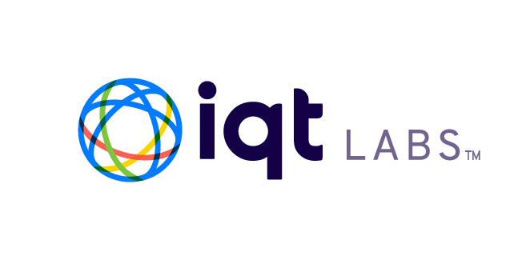
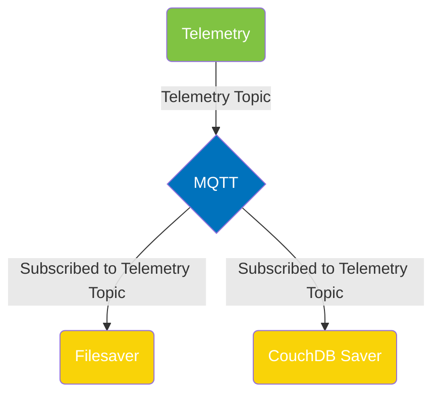

<a name="readme-top"></a>

[contributors-shield]: https://img.shields.io/github/contributors/IQTLabs/edgetech-telemetry-pinephone.svg?style=for-the-badge
[contributors-url]: https://github.com/IQTLabs/edgetech-telemetry-pinephone/graphs/contributors
[forks-shield]: https://img.shields.io/github/forks/IQTLabs/edgetech-telemetry-pinephone.svg?style=for-the-badge
[forks-url]: https://github.com/IQTLabs/edgetech-telemetry-pinephone/network/members
[stars-shield]: https://img.shields.io/github/stars/IQTLabs/edgetech-telemetry-pinephone.svg?style=for-the-badge
[stars-url]: https://github.com/IQTLabs/edgetech-telemetry-pinephone/stargazers
[issues-shield]: https://img.shields.io/github/issues/IQTLabs/edgetech-telemetry-pinephone.svg?style=for-the-badge
[issues-url]: https://github.com/IQTLabs/edgetech-telemetry-pinephone/issues
[license-shield]: https://img.shields.io/github/license/IQTLabs/edgetech-telemetry-pinephone.svg?style=for-the-badge
[license-url]: https://github.com/IQTLabs/edgetech-telemetry-pinephone/blob/master/LICENSE.txt
[product-screenshot]: images/screenshot.png

[Python]: https://img.shields.io/badge/python-000000?style=for-the-badge&logo=python
[Python-url]: https://www.python.org
[Poetry]: https://img.shields.io/badge/poetry-20232A?style=for-the-badge&logo=poetry
[Poetry-url]: https://python-poetry.org
[Docker]: https://img.shields.io/badge/docker-35495E?style=for-the-badge&logo=docker
[Docker-url]: https://www.docker.com

[![Contributors][contributors-shield]][contributors-url]
[![Forks][forks-shield]][forks-url]
[![Stargazers][stars-shield]][stars-url]
[![Issues][issues-shield]][issues-url]
[![MIT License][license-shield]][license-url]

<br />
<div align="center">
  <a href="https://iqtlabs.org/">
    
  </a>

<h1 align="center">EdgeTech-Telemetry-Pinephone</h1>

  <p align="center">
    This repo builds upon the <a href="https://github.com/IQTLabs/edgetech-core">IQT Labs EdgeTech-Core</a> functionality to instantiate an <a href="https://projects.eclipse.org/projects/iot.mosquitto">MQTT</a> client that publishes telemetry information to the MQTT bus from the PinePhone running `mobian`. Telemetry data is read from sensor files that are mapped to the Docker container in `docker-compose.yml` via volumes and published to on the telemetry MQTT topic. 
    <br/>
    <br/>
    <a href="https://github.com/IQTLabs/edgetech-telemetry-pinephone/pulls">Make Contribution</a>
    ·
    <a href="https://github.com/IQTLabs/edgetech-telemetry-pinephone/issues">Report Bug</a>
    ·
    <a href="https://github.com/IQTLabs/edgetech-telemetry-pinephone/issues">Request Feature</a>
  </p>
</div>

Current telemetry data being utilized:

```
battery capacity    :   /sys/class/power_supply/rk818-battery/capacity
uptime              :   /proc/uptime
```
    

### Built With

[![Python][Python]][Python-url]
[![Poetry][Poetry]][Poetry-url]
[![Docker][Docker]][Docker-url]

## Getting Started

To run this repo, simply run:

```
docker-compose up
```

The telemetry module is containerized and dependencies are managed using [poetry]("https://python-poetry.org"). 

### Prerequisites

Running this repo requires that you have [Docker](https://www.docker.com) installed. 

## Usage

Spinning up this system requires an MQTT server and this container to be included in your `docker-compose.yml`. You can find an example of this workflow in this repository's `docker-compose.yml`. Additionally, some editing of relevant environment variables will be required based upon your system's configuration of topics to subscribe to and MQTT configuration. Examples of these environment variables can be found in this repository's `.env` file. 

Copying the telemetry `docker-compose` statements into a master `docker-compose.yml` and  `.env` files with your entire system of containers is the preferred workflow. Find an application architecture diagram example of how the usage of this module was envisioned below.



## Roadmap

- TBA

See the [open issues](https://github.com/github_username/repo_name/issues) for a full list of proposed features (and known issues).

## Contributing

1. Fork the Project
2. Create your Feature Branch (`git checkout -b dev`)
3. Commit your Changes (`git commit -m 'adding some feature'`)
4. Run (and make sure they pass):
```
black --diff --check *.py

pylint --disable=all --enable=unused-import *.py

mypy --allow-untyped-decorators --ignore-missing-imports --no-warn-return-any --strict --allow-subclassing-any *.py
```
If you do not have them installed, you can install them with `pip install "black<23" pylint==v3.0.0a3 mypy==v0.991`.

5. Push to the Branch (`git push origin dev`)
6. Open a Pull Request

See `CONTRIBUTING.md` for more information.

## License

Distributed under the [Apache 2.0](https://github.com/IQTLabs/edgetech-telemetry-pinephone/blob/main/LICENSE). See `LICENSE` for more information.

## Contact IQTLabs

  - Twitter: [@iqtlabs](https://twitter.com/iqtlabs)
  - Email: info@iqtlabs.org

See our other projects: [https://github.com/IQTLabs/](https://github.com/IQTLabs/)

<p align="right">(<a href="#readme-top">back to top</a>)</p>
